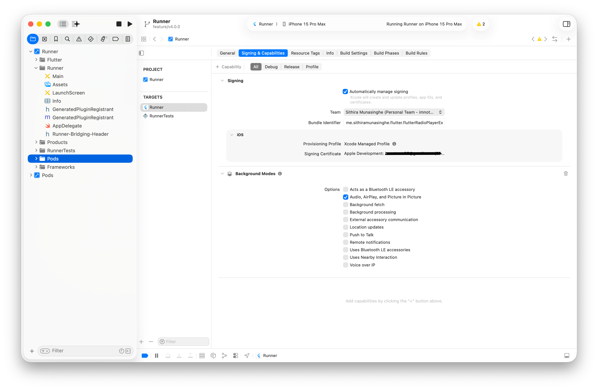

# Flutter Radio Player

[](https://pub.dev/packages/flutter_radio_player)
[](https://pub.dev/packages/flutter_radio_player)
[](https://pub.dev/packages/flutter_radio_player)
[](https://github.com/Sithira/FlutterRadioPlayer/actions/workflows/ci.yml)

A Flutter plugin for playing streaming radio URLs with background playback, lock screen controls, and platform-native media integrations including watchOS, WearOS, CarPlay, and Android Auto.

|             | Android | iOS     |
|-------------|---------|---------|
| **Support** | SDK 21+ | iOS 14+ |

## Features

- Background audio playback with no extra configuration
- Lock screen and notification media controls
- ICY/stream metadata extraction
- Multiple source queue with next/previous/jump-to navigation
- Volume control with stream updates
- watchOS, WearOS, CarPlay, and Android Auto integration

## Getting Started

### Installation

```bash
flutter pub add flutter_radio_player
```

### Usage

```dart
import 'package:flutter_radio_player/flutter_radio_player.dart';

final player = FlutterRadioPlayer();

// Initialize with sources
await player.initialize(
  [
    const RadioSource(url: 'https://s2-webradio.antenne.de/chillout?icy=https'),
    const RadioSource(
      url: 'https://radio.lotustechnologieslk.net:2020/stream/sunfmgarden?icy=https',
      title: 'SunFM - Sri Lanka',
      artwork: 'images/sample-cover.jpg', // bundled asset
    ),
    const RadioSource(url: 'http://stream.riverradio.com:8000/wcvofm.aac'),
  ],
  playWhenReady: true,
);
```

### Controlling Playback

```dart
await player.play();
await player.pause();
await player.playOrPause();
await player.nextSource();
await player.previousSource();
await player.jumpToSourceAtIndex(1);
await player.setVolume(0.8);
final volume = await player.getVolume();
await player.dispose();
```

### Listening to Streams

```dart
player.isPlayingStream.listen((bool isPlaying) {
  print('Playing: $isPlaying');
});

player.nowPlayingStream.listen((NowPlayingInfo info) {
  print('Now playing: ${info.title}');
});

player.volumeStream.listen((VolumeInfo vol) {
  print('Volume: ${vol.volume}, Muted: ${vol.isMuted}');
});
```

## Platform Setup

### Android

Add the following permissions to your app's `AndroidManifest.xml`:

```xml
<uses-permission android:name="android.permission.INTERNET" />
<uses-permission android:name="android.permission.FOREGROUND_SERVICE" />
<uses-permission android:name="android.permission.FOREGROUND_SERVICE_MEDIA_PLAYBACK" />
```

> These permissions are already declared by the plugin. You only need to add them if your app's manifest merger requires it.

### iOS

Enable **Audio, AirPlay, and Picture in Picture** under your target's **Signing & Capabilities > Background Modes** in Xcode:



If your radio streams use plain HTTP, add the following to your `Info.plist`:

```xml
<key>NSAppTransportSecurity</key>
<dict>
    <key>NSAllowsArbitraryLoads</key>
    <true/>
</dict>
```

## API Reference

### Methods

| Method                    | Description                            |
|---------------------------|----------------------------------------|
| `initialize(sources)`    | Set sources and optionally auto-play   |
| `play()`                 | Resume playback                        |
| `pause()`                | Pause playback                         |
| `playOrPause()`          | Toggle play/pause                      |
| `setVolume(double)`      | Set volume (0.0 to 1.0)               |
| `getVolume()`            | Get current volume                     |
| `nextSource()`           | Skip to next source                    |
| `previousSource()`       | Skip to previous source                |
| `jumpToSourceAtIndex(i)` | Jump to source at index                |
| `dispose()`              | Release player resources               |

### Streams

| Stream              | Type                    | Description                |
|---------------------|-------------------------|----------------------------|
| `isPlayingStream`   | `Stream<bool>`          | Playback state changes     |
| `nowPlayingStream`  | `Stream<NowPlayingInfo>`| Track metadata updates     |
| `volumeStream`      | `Stream<VolumeInfo>`    | Volume and mute changes    |

### Models

```dart
const RadioSource({required String url, String? title, String? artwork});
const NowPlayingInfo({String? title});
const VolumeInfo({required double volume, required bool isMuted});
```

## Migration from v3

```diff
// Sources
- player.initialize([{"url": "...", "title": "..."}], true);
+ player.initialize([const RadioSource(url: '...', title: '...')], playWhenReady: true);

// Streams
- player.getPlaybackStream()
+ player.isPlayingStream

- player.getNowPlayingStream()
+ player.nowPlayingStream

- player.getDeviceVolumeChangedStream()
+ player.volumeStream

// Methods
- player.prevSource()
+ player.previousSource()

- player.setVolume(0.5)     // unchanged
+ player.setVolume(0.5)

// New
+ await player.dispose();
+ await player.playOrPause();  // now works on iOS too
```

## Example

<p align="center">
  
</p>

See the [example app](example/) for a complete implementation.

## Support the Plugin

If you find this plugin useful, show your support by:

- Giving it a ⭐️ on [GitHub](https://github.com/Sithira/FlutterRadioPlayer)
- Leaving a like on Pub
- Showing some ♥️ and buying me a coffee via USDT-TR20 at this address: `TNuTkL1ZJGu2xntmtzHzSiH5YdVqUeAujr`

**Enjoy the plugin!**
Sithira ✌️

## Contributing

Contributions are welcome. Please open an issue first to discuss what you would like to change.

## License

[MIT](LICENSE)
