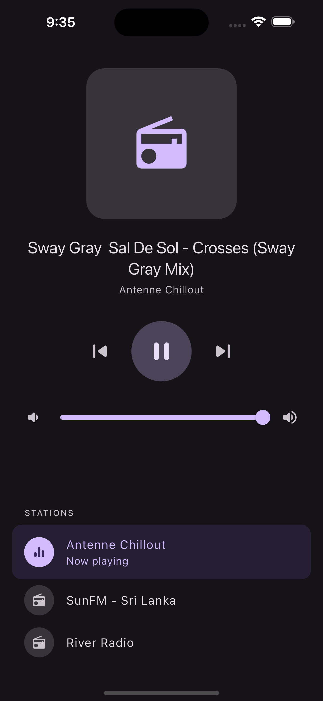
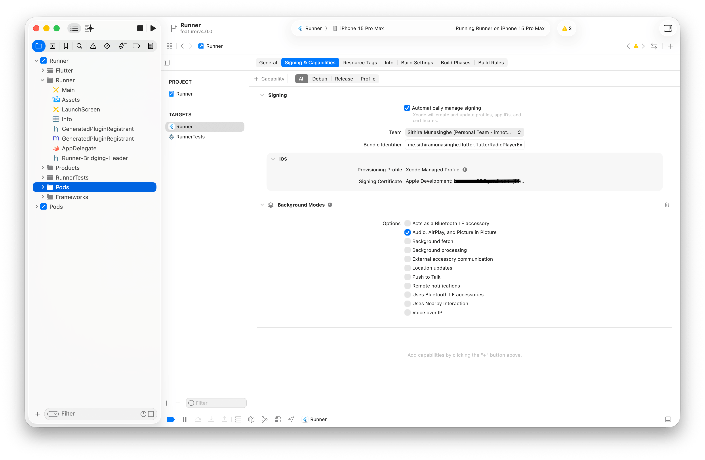

# Flutter Radio Player

[](https://pub.dev/packages/flutter_radio_player)
[](https://pub.dev/packages/flutter_radio_player)
[](https://pub.dev/packages/flutter_radio_player)
[](https://github.com/Sithira/FlutterRadioPlayer/actions/workflows/ci.yml)

A Flutter plugin for playing streaming radio with background playback, lock screen controls, and platform-native media integrations.

<p align="center">
  
</p>

|             | Android | iOS     |
|-------------|---------|---------|
| **Support** | SDK 21+ | iOS 14+ |

## Features

- Background audio playback with no extra configuration
- Lock screen and notification media controls
- ICY/Shoutcast metadata extraction
- Multiple source queue with next/previous/jump-to navigation
- Volume control with stream updates
- Artwork support (asset paths and remote URLs)
- watchOS, WearOS, CarPlay, and Android Auto integration
- Swift Package Manager and CocoaPods support on iOS

## Quick Start

### Installation

```bash
flutter pub add flutter_radio_player
```

### Minimal Example

```dart
import 'package:flutter_radio_player/flutter_radio_player.dart';

final player = FlutterRadioPlayer();

await player.initialize([
  const RadioSource(url: 'https://example.com/stream'),
], playWhenReady: true);
```

## Working with Sources

Define your radio stations using the `RadioSource` model:

```dart
const sources = [
  RadioSource(url: 'https://example.com/stream'),
  RadioSource(
    url: 'https://example.com/jazz',
    title: 'Jazz FM',
    artwork: 'assets/jazz_cover.jpg', // bundled asset
  ),
  RadioSource(
    url: 'https://example.com/rock',
    title: 'Rock Radio',
    artwork: 'https://example.com/rock_cover.png', // remote URL
  ),
];

await player.initialize(sources, playWhenReady: true);
```

| Field     | Type      | Description                          |
|-----------|-----------|--------------------------------------|
| `url`     | `String`  | Stream URL (required)                |
| `title`   | `String?` | Display name for lock screen         |
| `artwork` | `String?` | Asset path or URL for album artwork  |

## Working with Playback Controls

```dart
await player.play();
await player.pause();
await player.playOrPause(); // toggle

// Navigate sources
await player.nextSource();
await player.previousSource();
await player.jumpToSourceAtIndex(2);

// Volume (0.0 to 1.0)
await player.setVolume(0.8);
final volume = await player.getVolume();

// Clean up when done
await player.dispose();
```

## Working with Streams

Listen to real-time player state changes using streams:

### Playback State

```dart
player.isPlayingStream.listen((bool isPlaying) {
  print(isPlaying ? 'Playing' : 'Paused');
});
```

### Now Playing / ICY Metadata

```dart
player.nowPlayingStream.listen((NowPlayingInfo info) {
  print('Now playing: ${info.title}');
});
```

The `nowPlayingStream` automatically extracts ICY metadata from Shoutcast/Icecast streams. If the stream provides metadata (e.g., artist and song title), it will appear here without any extra configuration.

### Volume Changes

```dart
player.volumeStream.listen((VolumeInfo vol) {
  print('Volume: ${vol.volume}, Muted: ${vol.isMuted}');
});
```

## Full Example

A complete player widget with play/pause, skip controls, metadata display, and volume slider:

```dart
import 'package:flutter/material.dart';
import 'package:flutter_radio_player/flutter_radio_player.dart';

class RadioPlayerWidget extends StatefulWidget {
  const RadioPlayerWidget({super.key});

  @override
  State<RadioPlayerWidget> createState() => _RadioPlayerWidgetState();
}

class _RadioPlayerWidgetState extends State<RadioPlayerWidget> {
  final _player = FlutterRadioPlayer();
  double _volume = 0.5;

  @override
  void initState() {
    super.initState();
    _player.initialize([
      const RadioSource(
        url: 'https://s2-webradio.antenne.de/chillout?icy=https',
        title: 'Antenne Chillout',
      ),
      const RadioSource(
        url: 'https://radio.lotustechnologieslk.net:2020/stream/sunfmgarden?icy=https',
        title: 'SunFM - Sri Lanka',
      ),
    ], playWhenReady: true);
  }

  @override
  void dispose() {
    _player.dispose();
    super.dispose();
  }

  @override
  Widget build(BuildContext context) {
    return Column(
      mainAxisAlignment: MainAxisAlignment.center,
      children: [
        // Now playing info
        StreamBuilder<NowPlayingInfo>(
          stream: _player.nowPlayingStream,
          builder: (context, snapshot) {
            final title = snapshot.data?.title ?? 'No track info';
            return Text(title, style: Theme.of(context).textTheme.titleLarge);
          },
        ),
        const SizedBox(height: 24),

        // Transport controls
        StreamBuilder<bool>(
          stream: _player.isPlayingStream,
          builder: (context, snapshot) {
            final isPlaying = snapshot.data ?? false;
            return Row(
              mainAxisAlignment: MainAxisAlignment.center,
              children: [
                IconButton(
                  iconSize: 36,
                  onPressed: _player.previousSource,
                  icon: const Icon(Icons.skip_previous_rounded),
                ),
                IconButton(
                  iconSize: 48,
                  onPressed: () => isPlaying ? _player.pause() : _player.play(),
                  icon: Icon(isPlaying ? Icons.pause_rounded : Icons.play_arrow_rounded),
                ),
                IconButton(
                  iconSize: 36,
                  onPressed: _player.nextSource,
                  icon: const Icon(Icons.skip_next_rounded),
                ),
              ],
            );
          },
        ),
        const SizedBox(height: 16),

        // Volume slider
        Row(
          children: [
            const Icon(Icons.volume_down_rounded),
            Expanded(
              child: Slider(
                value: _volume,
                onChanged: (value) {
                  setState(() => _volume = value);
                  _player.setVolume(value);
                },
              ),
            ),
            const Icon(Icons.volume_up_rounded),
          ],
        ),
      ],
    );
  }
}
```

See the [example app](packages/flutter_radio_player/example/) for the full runnable project.

## Platform Setup

### Android

Add the following permissions to your `AndroidManifest.xml`:

```xml
<uses-permission android:name="android.permission.INTERNET" />
<uses-permission android:name="android.permission.FOREGROUND_SERVICE" />
<uses-permission android:name="android.permission.FOREGROUND_SERVICE_MEDIA_PLAYBACK" />
```

> `FOREGROUND_SERVICE` and `FOREGROUND_SERVICE_MEDIA_PLAYBACK` are already declared by the plugin. `INTERNET` must be declared by the host app.

If your radio streams use plain HTTP (not HTTPS), opt in to cleartext traffic. Either add the attribute to your `<application>` tag:

```xml
<application
    android:usesCleartextTraffic="true"
    ...>
```

Or, preferred, whitelist only the streaming domains via a network security config (`res/xml/network_security_config.xml`):

```xml
<network-security-config>
    <domain-config cleartextTrafficPermitted="true">
        <domain includeSubdomains="true">your-stream-host.example.com</domain>
    </domain-config>
</network-security-config>
```

Then reference it from your `<application>` tag: `android:networkSecurityConfig="@xml/network_security_config"`.

### iOS

1. Enable **Audio, AirPlay, and Picture in Picture** under your target's **Signing & Capabilities > Background Modes** in Xcode:



2. If your radio streams use plain HTTP, add the following to your `Info.plist`:

```xml
<key>NSAppTransportSecurity</key>
<dict>
    <key>NSAllowsArbitraryLoads</key>
    <true/>
</dict>
```

3. **Swift Package Manager** is supported alongside CocoaPods (Flutter 3.24+). No additional configuration is needed.

## API Reference

### Methods

| Method                    | Description                            |
|---------------------------|----------------------------------------|
| `initialize(sources)`     | Set sources and optionally auto-play   |
| `play()`                  | Resume playback                        |
| `pause()`                 | Pause playback                         |
| `playOrPause()`           | Toggle play/pause                      |
| `setVolume(double)`       | Set volume (0.0 to 1.0)               |
| `getVolume()`             | Get current volume                     |
| `nextSource()`            | Skip to next source                    |
| `previousSource()`        | Skip to previous source                |
| `jumpToSourceAtIndex(i)`  | Jump to source at index                |
| `dispose()`               | Release player resources               |

### Streams

| Stream              | Type                     | Description                |
|---------------------|--------------------------|----------------------------|
| `isPlayingStream`   | `Stream<bool>`           | Playback state changes     |
| `nowPlayingStream`  | `Stream<NowPlayingInfo>` | Track metadata updates     |
| `volumeStream`      | `Stream<VolumeInfo>`     | Volume and mute changes    |

### Models

| Model            | Fields                                               |
|------------------|------------------------------------------------------|
| `RadioSource`    | `url` (String), `title` (String?), `artwork` (String?) |
| `NowPlayingInfo` | `title` (String?)                                    |
| `VolumeInfo`     | `volume` (double), `isMuted` (bool)                  |

## Architecture

This is a [federated plugin](https://docs.flutter.dev/packages-and-plugins/developing-packages#federated-plugins) split into four packages:

| Package | Description |
|---------|-------------|
| [`flutter_radio_player`](packages/flutter_radio_player/) | App-facing API |
| [`flutter_radio_player_platform_interface`](packages/flutter_radio_player_platform_interface/) | Shared interface and models |
| [`flutter_radio_player_android`](packages/flutter_radio_player_android/) | Android implementation (Media3/ExoPlayer) |
| [`flutter_radio_player_ios`](packages/flutter_radio_player_ios/) | iOS implementation (AVFoundation) |

Platform communication uses [Pigeon](https://pub.dev/packages/pigeon) for type-safe code generation.

## Migration from v3

See the [Migration Guide](MIGRATION.md) for detailed upgrade instructions.

## Support the Plugin

If you find this plugin useful:

- Give it a star on [GitHub](https://github.com/Sithira/FlutterRadioPlayer)
- Leave a like on [pub.dev](https://pub.dev/packages/flutter_radio_player)
- Buy me a coffee via USDT-TR20: `TNuTkL1ZJGu2xntmtzHzSiH5YdVqUeAujr`

## Contributing

Contributions are welcome. Please open an issue first to discuss what you would like to change.

## License

[MIT](LICENSE)
