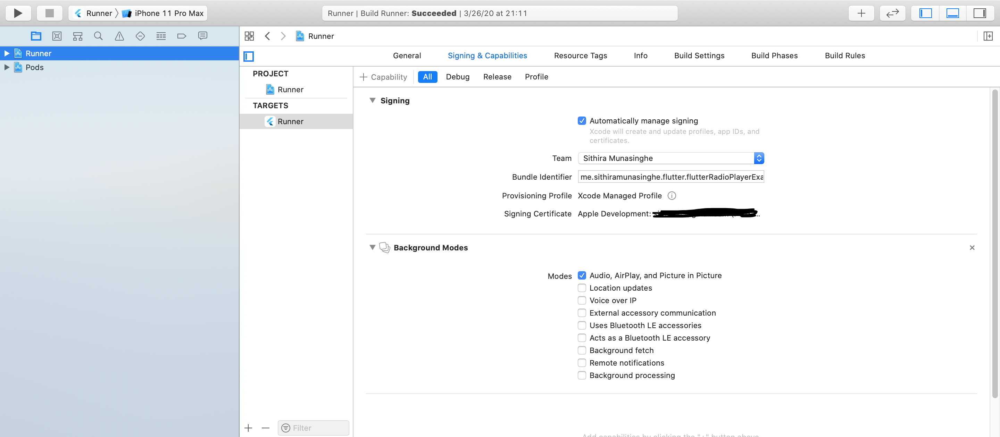

# Flutter Radio Player Example

Demonstrates how to use the flutter_radio_player plugin. 
Kindly look at the main.dart for further clarification.

## Getting Started

This project is a starting point for a Flutter application.

If the plugin is failing to initiate, kindly make sure your permission for background processes are given for your application

For your Android application you might want to add permissions in `AndroidManifest.xml`. This is already added for in the library level.
```xml
    <!--  Permissions for the plugin  -->
    <uses-permission android:name="android.permission.FOREGROUND_SERVICE" />
    <uses-permission android:name="android.permission.INTERNET" />

    <!--  Services for the plugin  -->
    <application android:usesCleartextTraffic="true">
        <service android:name=".core.StreamingCore"/>
    </application>
```

For your iOS application you need to enable it like this



A few resources to get you started if this is your first Flutter project:

- [Lab: Write your first Flutter app](https://flutter.dev/docs/get-started/codelab)
- [Cookbook: Useful Flutter samples](https://flutter.dev/docs/cookbook)

For help getting started with Flutter, view our
[online documentation](https://flutter.dev/docs), which offers tutorials,
samples, guidance on mobile development, and a full API reference.
